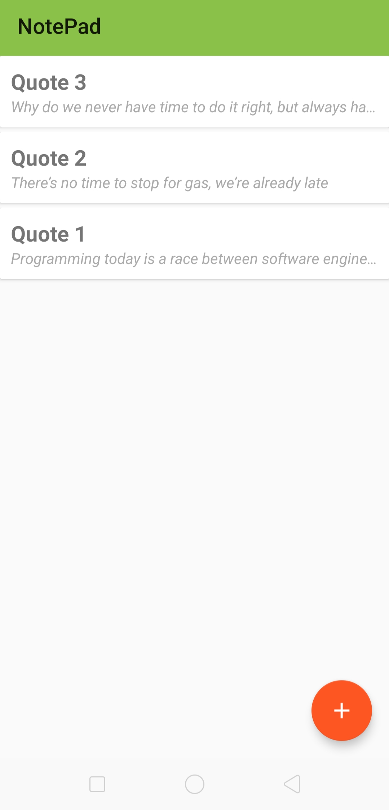
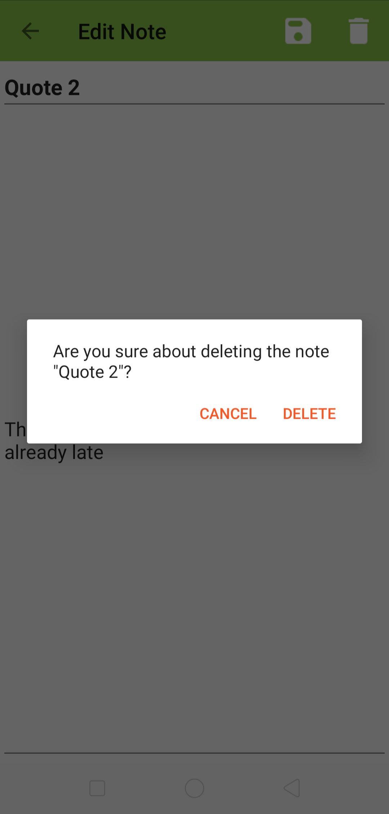
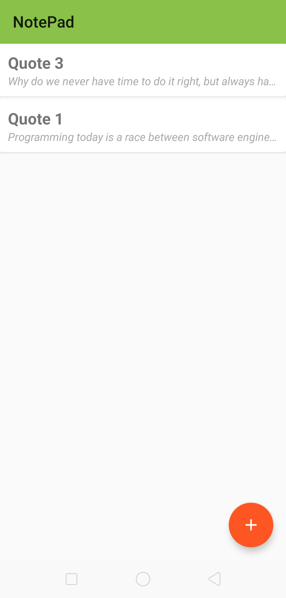
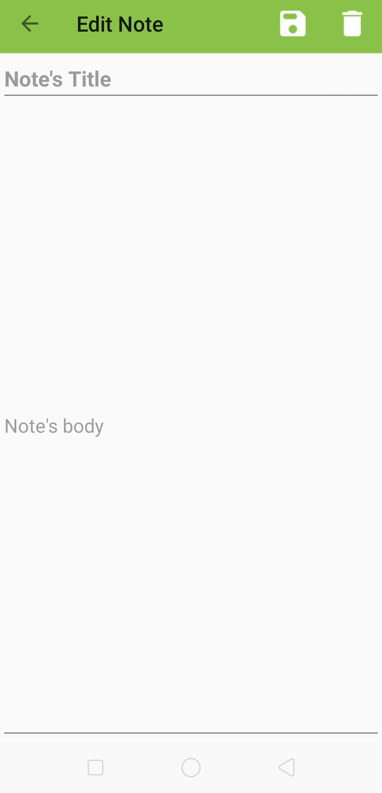

# NotePad-Application-With-Kotlin

## Introduction

This is my first Android application !

## Project's Configuration

- **Android API:** 21 ( Android 5.0 ).

- **Programming Language :** Kotlin

- **Phone used for Test:** Oppo F11

> **Note:** I used file storage for data persistence 

## Screenshots of the final project 

     

